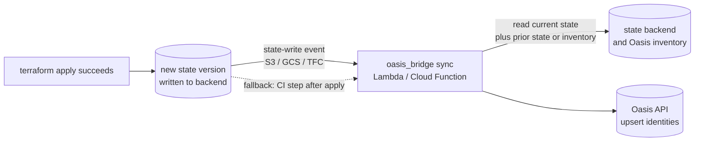

# Architecture

A module-level walkthrough of the bridge: how data flows, what each piece owns,
the data model, the two sync baselines, and how to extend it. For the conceptual
"why" see [../README.md](../README.md); for sequence diagrams see
[flow-overview.md](flow-overview.md).

## One-directional pipeline

Everything is a one-way transformation from Terraform's JSON to the Oasis API:

```
terraform show -json
        │
        ▼
   tf_parser ──► differ ──► translator ──► oasis_client ──► Oasis API
   (parse)      (diff ->    (TF resource   (HTTP)          (mock_oasis/)
                 events)    -> Oasis id)
```

The two CLIs — `sync_cli.py` and `gate_cli.py` — are thin: they parse arguments,
compose the modules above, and print results. **They contain no business logic on
purpose**, so the same core can be lifted into a Lambda handler or a CI step
without change.

## Modules

| Module | Responsibility |
|---|---|
| `models.py` | Plain dataclasses shared by everything: `TerraformResource`, `OasisIdentity`, `IdentityChange`, `PlanChange`, plus the `LifecycleEvent` / `Verdict` enums and the `IDENTITY_RESOURCE_TYPES` / `SECRET_RESOURCE_TYPES` sets that classify resources. |
| `tf_parser.py` | Parses `terraform show -json`. `parse_state()` returns identity resources keyed by TF **address**; `parse_plan()` returns proposed `PlanChange`s. Both read the *same* schema, which is why one parser serves both hooks. |
| `differ.py` | Turns parsed input into `IdentityChange` events. Two entrypoints — `diff_states` (two state files) and `diff_against_inventory` (state vs. Oasis inventory). Also flags privilege-increase policy attachments. |
| `translator.py` | Maps a `TerraformResource` to an `OasisIdentity`: resolves ownership, sets `source: terraform`, and folds access keys into their user as `associated_secrets`. |
| `oasis_client.py` | Thin `httpx` wrapper over the three Oasis endpoints. Base URL from `--api-url` or `OASIS_API_URL` (default `http://127.0.0.1:8080`). |
| `sync_cli.py` | `oasis-sync` entrypoint — picks the differ mode based on whether `--old` is given, prints the diff + reconciliation report + before/after inventory. |
| `gate_cli.py` | `oasis-gate` entrypoint — sends plan changes for review and maps the verdict to an exit code (deny → non-zero). |

## Data model (`models.py`)

- **`TerraformResource`** — one identity-relevant resource pulled from state.
  Keyed on `address` (e.g. `aws_iam_role.payment_processor`), which is stable
  across applies even when the ARN is "known after apply". Carries the raw
  `values` dict.
- **`OasisIdentity`** — the Oasis-schema record: `id` (ARN), `type`, `name`,
  `owner`, `source`, `lifecycle_status`, `attached_policies`,
  `associated_secrets`, `tags`, `created_at`. `to_dict()` is the wire format.
- **`IdentityChange`** — an `OasisIdentity` plus a `LifecycleEvent`
  (`create` / `update` / `destroy`) and human-readable `notes`.
- **`PlanChange`** — a proposed change from a plan: `address`, `tf_type`,
  `action`, and `before` / `after` value dicts.

The set of types treated as identities lives in `IDENTITY_RESOURCE_TYPES`, and the
subset that are credentials (folded into their owner) in `SECRET_RESOURCE_TYPES`.

## The two sync baselines

`sync_cli.py` chooses a differ based on whether `--old` is supplied.

### Two-file diff — `diff_states(old_state, new_state)`

Set-diffs two parsed states **by TF address**:

- address in new only → **CREATE**
- address in old only → **DESTROY** (`lifecycle_status → decommissioned`)
- address in both, `values` differ → **UPDATE**

Keying by address (not ARN) is deliberate: it survives "ARN known after apply", so
create/update/destroy are unambiguous even when ARNs are assigned late. The caller
must retain the previous state file.

### Inventory diff — `diff_against_inventory(new_state, inventory)`

Uses the **live Oasis inventory as the baseline**, so no prior state file is
retained. Keys **by ARN (`id`)**, because post-apply state carries real ARNs and
the inventory is ARN-keyed — which is exactly what lets a Terraform role line up
with an already-discovered record for free:

- ARN in state, absent from inventory → **CREATE**
- ARN in both, tracked fields differ → **UPDATE** (including the
  `oasis_discovery → terraform` reconciliation, computed by `_inventory_delta`)
- `source: terraform` record absent from state → **DESTROY** (*source-scoped*)

**Source-scoped destroys** are the important subtlety: a single Terraform state is
not the whole inventory (it also holds `oasis_discovery` records and other
workspaces' resources), so a naive "absent → destroy" would wrongly decommission
them. The differ only decommissions records this bridge itself previously stamped
`source: terraform`. This is safe but not workspace-complete — see
[Known limitations](../README.md#known-limitations).

Both modes reuse the same helpers for policy deltas (`_policy_delta_lists`) and
privilege-increase detection (`_is_sensitive`), so that logic isn't duplicated.

## Sync triggering & deployment

**Detective, by inference.** Terraform writes a new state version only *after* a
successful apply. The bridge doesn't watch Terraform or AWS — the **existence of a
newer state version is the evidence an apply ran**. That's what "detective" means
here, and it's why the sync can only reconcile (record reality), never block it;
prevention is the gate's job at plan-time.

**Two trigger paths:**

- **Event-driven (headline, zero-touch).** The state backend's *write event* invokes
  the sync directly:
  - **S3** backend → an `ObjectCreated` bucket notification on the state key → a Lambda
    (or SQS → worker).
  - **GCS** backend → an object-finalize notification → a Cloud Function.
  - **Terraform Cloud / Enterprise** → a run-completed / state-version-created webhook
    → an endpoint you host.

  This covers *every* apply — CI, local, or laptop — with no HCL or pipeline changes.
- **CI post-apply step (fallback).** The `oasis-sync` step that runs after
  `terraform apply` in a pipeline (see
  [`.github/workflows/terraform-oasis.yml`](../.github/workflows/terraform-oasis.yml)).
  This only covers applies that go through *that* pipeline.

**Deployment shape.** The `oasis_bridge` package runs on the **platform (vendor)
side** as the compute behind the event — a Lambda / Cloud Function / small service.
It needs (a) read access to the state backend to fetch the current state (and, in
two-file mode, the previous version), and (b) network access to the Oasis API. It is
**not** installed into the customer's Terraform config or pipeline for the
event-driven path — that is precisely the "zero-touch" claim. (The gate is the
opposite: it lives *inside* the customer's CI, as a step between plan and apply.)



**Where old / new state come from** (see [the two sync baselines](#the-two-sync-baselines)):
*new* is the just-written object the event fired on; *old* is the previous version
from the backend's own history (S3 versioning / the TFC state-version API) — or you
use **inventory mode** (`diff_against_inventory`) to drop the need for an "old" file
entirely.

**PoC status.** None of this triggering or deployment is implemented in this repo. In
the PoC you invoke `oasis-sync` by hand with file paths; the event wiring lives
outside the repo. That's consistent with "not production code" — the point here is the
diff / translate / upsert logic, not the plumbing that would drive it.

## Design decision: CI step vs. Terraform provider

A reasonable question is why the **gate** is a CI step (and the sync an out-of-band,
event-driven job) rather than a custom **Oasis Terraform provider**. A provider would
integrate one of two ways: a `resource "oasis_identity"` you declare per NHI (so
`apply` registers it and `destroy` deregisters it, in-graph), or a plan-time
`data "oasis_policy_review"` / precondition that fails the plan on a deny. Both are
legitimate; the PoC led with the CI-step + event path for five reasons:

1. **Whole-plan visibility + central policy.** The gate ships the entire
   `terraform show -json` to Oasis and evaluates cross-resource rules server-side
   (e.g. "a new admin role *and* a long-lived key"). A provider data source sees only
   its own resource's config at plan time and can't reason across the change set;
   policy living in Oasis also means rules change once, with no provider release.
2. **Zero / minimal HCL changes.** The gate is a pipeline step — no customer HCL is
   touched. A provider needs `oasis_` blocks on every identity: invasive, easy to
   forget, so coverage becomes opt-in per resource.
3. **Distribution friction.** A real provider is a Go plugin, published to a registry,
   version-pinned, and upgraded in every consumer repo — the opposite of "central
   policy owned by Oasis."
4. **Trust boundary.** The script/server model keeps policy evaluation on Oasis's side.
   A provider runs *inside* the customer's Terraform process with their cloud creds.
5. **Coverage (the decisive one).** The **sync** is detective and must catch applies
   that never ran Terraform-with-the-provider — local, laptop, other pipelines, console
   clicks. Only an out-of-band, state/event-driven mechanism gives that universal
   coverage; a provider only fires when Terraform runs with it configured, leaving
   exactly the gaps sync + discovery exist to close (see
   [Known limitations](../README.md#known-limitations)).

**Honest counterpoint.** A provider genuinely *wins* for native lifecycle coupling:
`terraform destroy` transactionally deregistering the Oasis record, drift surfacing in
`terraform plan`, and inline plan-time feedback without a separate CI step. A mature
product would likely offer **both** — the CI/event integration for universal zero-touch
coverage, and an optional provider for teams wanting first-class, in-graph integration.
Because the parse → translate → policy core lives in `oasis_bridge/` independently of
either entrypoint, wrapping it in a provider later is additive, not a rewrite.

## Ownership resolution (`translator.resolve_owner`)

Terraform is the source of accountability discovery lacks. Owner is resolved by a
clear precedence:

1. explicit `owner` tag — most intentional
2. `team` tag → `team:<name>`
3. Terraform module path → `module:<path>` — structural fallback
4. `None` — flagged downstream as needs-owner

In a real integration you'd add Git provenance (commit author / CODEOWNERS)
captured by a CI hook — state alone doesn't carry it.

## Classification (`translator.classify`)

Discovery can see that an identity exists but not how much it matters. Terraform
carries that signal in tags, module structure, and the policies actually attached, so
`classify()` derives a `classification` block with a documented precedence per field:

| Field | Precedence |
|---|---|
| `environment` | `environment` tag → `env` tag → environment token in the module path |
| `criticality` | `criticality` tag → `tier` tag → `"high"` if privileged |
| `data_sensitivity` | `data_classification` tag → `data_class` tag |
| `privileged` | any attached managed policy is administrative (`is_sensitive_policy`) |
| `credential_type` | derived from the **trust policy** — see below |

### Workload identity: `credential_type`

The assignment lists "workload identities" among the NHIs to govern. Rather than adding
a resource type per flavour, `credential_type()` derives the security-meaningful
property — *how does this identity authenticate?* — by parsing `assume_role_policy`:

| Value | Meaning |
|---|---|
| `federated` | assumed via an OIDC/SAML provider (GitHub Actions, IRSA) — **no standing credential** |
| `service` | assumed by an AWS service principal (`lambda.amazonaws.com`, …) |
| `static_key` | fronted by a long-lived IAM access key |
| `assumed_role` | trusted by an AWS account/principal |
| `service_account` | a `google_service_account` (multi-cloud NHI) |

This is the contrast the demo makes concrete: `github-actions-deployer` is `federated`
with **zero** associated secrets, while `batch-runner` is `static_key` with one — the
long-lived credential the gate already denies at plan time. Parsing is deliberately
tolerant (a trust policy we can't read yields `None` rather than failing a sync).

OIDC/SAML providers themselves are **trust anchors, not identities**
(`FEDERATION_RESOURCE_TYPES`): they're parsed for context and excluded by
`is_standalone_identity`, alongside secrets and rotation config.

`is_sensitive_policy` lives here and is shared with `differ.py`, so "privilege
increase" means the same thing in classification and in diff notes. (`mock_oasis/
policy.py` deliberately keeps its own copy — server-side policy is owned by Oasis, not
by this client.)

## Identity lifecycle: creation → deprecation → decommission

`LifecycleStatus` (`models.py`) carries five states, and **two independent sources**
drive the transitions — neither sufficient alone:

| Status | Set by | Meaning |
|---|---|---|
| `active` | sync | declared in Terraform and in use |
| `deprecated` | sync **+** discovery | stale in Oasis but still declared in Terraform |
| `decommission_pending` | sync | Terraform destroyed it — awaiting scan confirmation |
| `decommissioned` | **discovery** | a scan confirmed the principal is gone (terminal) |
| `orphaned` | **discovery** | Terraform disowned it, but the scan still sees it live ⚠ |

Two of these are the whole argument for bridging the systems:

- **`deprecated`** needs both sides. Oasis knows the identity hasn't been used
  (`last_used`, `is_stale`); Terraform knows it's still coded. Neither can conclude
  "unused but still provisioned — clean it up" alone. `diff_against_inventory` makes
  that call because it holds both sides; `diff_states` (two files, no inventory)
  structurally cannot — an asymmetry between the modes.
- **`decommission_pending` → `decommissioned` | `orphaned`** exists because *Terraform
  saying an identity is gone is a claim, not proof*. A failed destroy, a
  `terraform state rm`, or an out-of-band recreate leaves a live, usable principal
  behind. Retiring it on Terraform's word alone would stop governance of a working
  credential — so sync parks it at `pending` and only a scan settles it. When the scan
  still finds it, the conflict surfaces as `orphaned` rather than being silently
  mislabelled.

## Field ownership & merge semantics

The two systems own different halves of a record:

- **Terraform-owned (authoritative):** `owner`, `source`, `classification`,
  `attached_policies`, `tags`, `lifecycle_status`.
- **Discovery-owned (runtime facts Terraform cannot observe):** `last_used`,
  `is_stale`, and secret rotation *timestamps* (`last_rotated_at`, `next_rotation_at`).

So the translator leaves discovery-owned fields `None` rather than guessing, and the
Oasis side **merges instead of replacing** (`server.py::_merge`, with
`DISCOVERY_OWNED_FIELDS`): an incoming `None` for a discovery-owned field is dropped,
never written. Without this, every sync would erase the usage data that makes staleness
— and therefore deprecation — detectable.

## Secret folding (`translator`)

An `aws_iam_access_key` is a credential, not a standalone identity. `translator`
folds each key into its owning `aws_iam_user` as an `associated_secrets` entry, and
`is_standalone_identity` keeps keys from ever surfacing as their own
`IdentityChange`. This mirrors how Oasis models a user and its keys as one record.

## The mock Oasis server (`mock_oasis/`)

Simulates just enough of the server side to demonstrate the integration end to end.

**`server.py`** — a FastAPI app with an in-memory `INVENTORY` dict, seeded by `_seed()`
with two identities that look "discovered" (`owner: None`, `source: "oasis_discovery"`,
no classification) to demonstrate reconciliation when Terraform data lands on top of
them. One seeded role is deliberately **stale** (`is_stale: true`, unused since 2024)
so the demo can show a real `deprecated` transition. Upserts go through `_merge`, not a
blind replace (see [field ownership](#field-ownership--merge-semantics)). Endpoints:

| Endpoint | Purpose |
|---|---|
| `GET /api/v1/identities` | current inventory |
| `POST /api/v1/identities:sync` | upsert a batch of changes, return a field-level reconciliation report |
| `POST /api/v1/terraform/plan-review` | central policy verdict for a plan |
| `POST /api/v1/discovery:scan` | reconcile the inventory against what a scan observed |
| `POST /api/v1/_reset` | restore the seeded inventory (demo/test convenience) |

**`discovery.py`** — the third source of truth, and the one that makes the bridge's
claims *true*. `scan(inventory, live_identities)` judges only the records Terraform has
disowned (`decommission_pending` / `orphaned`), because it answers exactly one question:
**does this principal still exist?** Present → `orphaned`; absent → `decommissioned`.
An orphan resolves to `decommissioned` on a later scan once it really disappears.

Note what is deliberately absent: `oasis_client.py` has **no** scan method. Discovery is
Oasis's own capability — the Terraform bridge never triggers it, which is what keeps the
two sources genuinely independent rather than one calling the other.

**`policy.py`** — the plan-review rule engine. `RULES` is a list of pure functions,
each `change -> Violation | None`. Any **high**-severity violation forces verdict
`deny`; anything else with violations is `approve_with_warnings`; otherwise
`approve`.

## Extending it

- **New identity resource type** (e.g. a GCP service account): add the Terraform
  type to `IDENTITY_RESOURCE_TYPES` in `models.py` — and to `SECRET_RESOURCE_TYPES`
  if it's a credential. The parser, differ, and translator all key off those sets.
- **New policy rule:** add a pure `change -> Violation | None` function in
  `mock_oasis/policy.py` and append it to `RULES`.
- **Fixtures as spec:** `samples/state_v1.json` / `state_v2.json` and
  `plan_approved.json` / `plan_denied.json` are hand-crafted `terraform show -json`
  fixtures that exercise every code path. `tests/test_bridge.py` asserts against
  them directly, so when you change differ/translator/policy behavior, check whether
  the fixtures need updating too.
