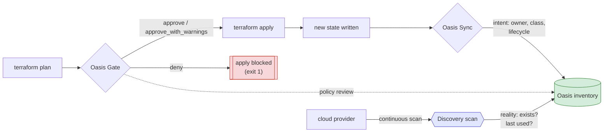
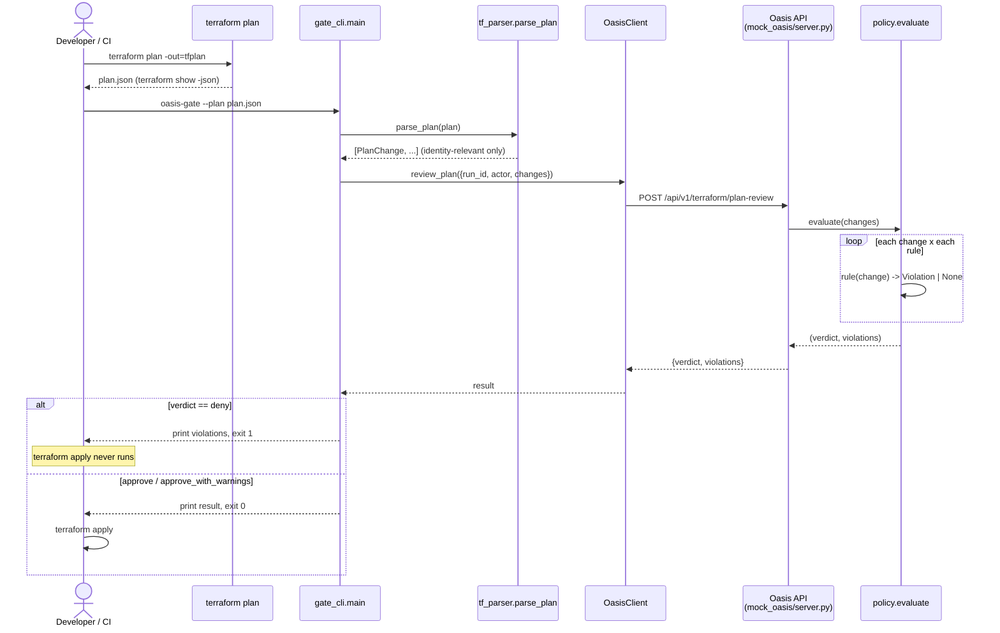
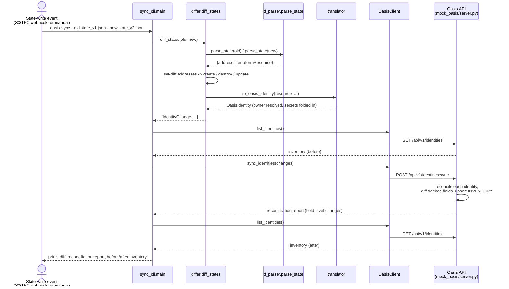
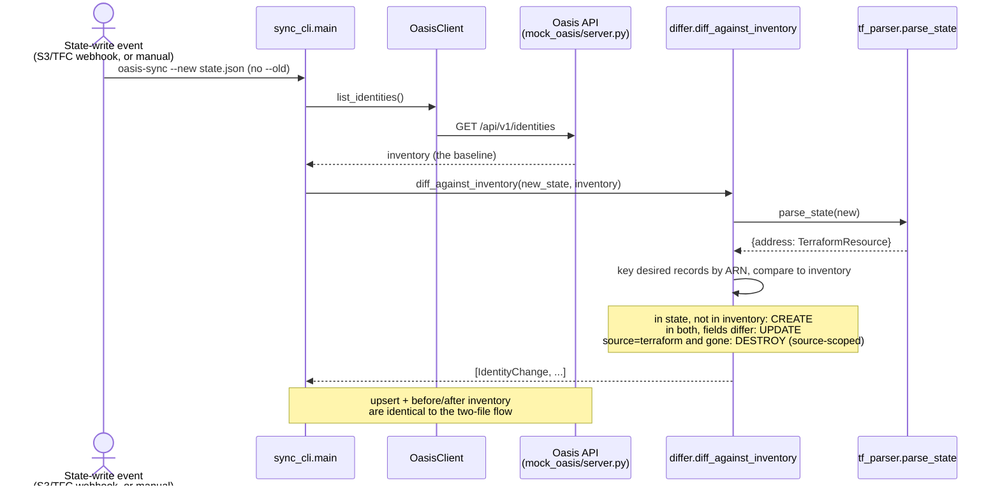

# Flow overview

The bridge has two independent hooks into the Terraform lifecycle: a preventive
**gate** at plan-time and a detective **sync** at apply-time. Both share the same
parser (`oasis_bridge/tf_parser.py`) and talk to the same Oasis API, but they read
different artifacts (plan vs. state) and differ in whether they can block anything.

## High-level flow

Note the **two** writers into the inventory. Sync supplies what only Terraform knows
(intent, ownership, classification); discovery supplies what only a scan can know
(existence, usage). Neither overwrites the other's half — and where they disagree, the
disagreement is the finding.

- **Gate** (`oasis_bridge/gate_cli.py`) — opt-in CI step. Reviews the *proposed*
  plan against central Oasis policy (`mock_oasis/policy.py`) — not just *what* an
  identity can do (admin policies, long-lived keys) but *who may assume* it (a
  wildcard trust `Principal` is denied; an unconstrained cross-account one is
  warned), on update as well as create. Each change carries `before`/`after` so a
  trust rule flags only newly added principals. A `deny` verdict stops the pipeline
  before `apply` ever runs.
- **Discovery** (`mock_oasis/discovery.py`) — continuous, server-side. Scans the cloud
  for what actually exists. It confirms (or contradicts) what sync only *claims*: a
  destroyed identity sits at `decommission_pending` until a scan either confirms it is
  gone (`decommissioned`) or finds it still live (`orphaned`). The bridge never calls
  it — that independence is the point.
- **Sync** (`oasis_bridge/sync_cli.py`) — zero-touch. Diffs Terraform *state* and
  reconciles the Oasis inventory with the ground truth Terraform has (owner,
  source, lifecycle status). Runs after every apply, regardless of whether the gate
  was adopted. The baseline for the diff is either the previous state file
  (`diff_states`) or the live Oasis inventory (`diff_against_inventory`) — see
  [Variant: inventory-diff sync](#variant-inventory-diff-sync).

> The `State-write event` actor below is what triggers the sync in production (an
> S3 / GCS / TFC state-write event, or a manual run). For how that works and how the
> sync is deployed, see
> [Sync triggering & deployment](architecture.md#sync-triggering--deployment).

## Sequence: Gate (plan-time policy review)

## Sequence: Sync (two-file state diff)

## Variant: inventory-diff sync

Omit `--old` and the sync uses the **live Oasis inventory as the baseline** instead
of a previous state file — so nothing has to be retained between applies. The only
difference is the top of the diff: the "old" side is fetched over HTTP rather than
loaded from disk, and the diff keys by **ARN** (`id`) rather than TF address.

Because a single state is not the whole inventory, DESTROY is **source-scoped**:
only records already stamped `source: terraform` are decommissioned when they
vanish — discovery and other-workspace records are left alone. See
[Known limitations](../README.md#known-limitations) and
[architecture.md](architecture.md#the-two-sync-baselines).

## Notes

- The gate and sync hooks are decoupled on purpose: a team can adopt the gate
  without the sync (or vice versa), and the sync remains the backstop for
  applies that never went through CI (local, laptop, other pipelines).
- `is_standalone_identity` means `aws_iam_access_key` resources never appear as
  their own `IdentityChange` — they're folded into their owning `aws_iam_user`
  as `associated_secrets` inside `translator.to_oasis_identity`.
- See [README.md](../README.md) for the conceptual gap this closes and known
  limitations, and [architecture.md](architecture.md) for the module-level
  walkthrough, data model, and the two sync baselines.
